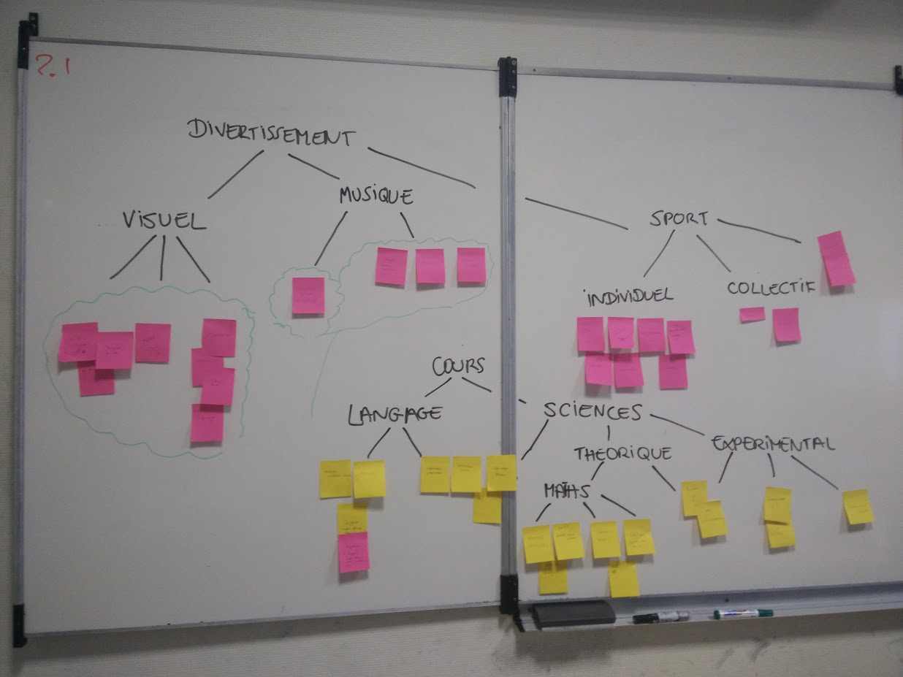

=== Fiche d’identité du groupe

La recherche de l'identité de groupe a commencée la toute première journée du PACT 
lorsque nous avons rencontré nos groupes pour la première fois et lorsque nous avons réalisé 
plusieurs exercices de prises de paroles et de communication entre nous. Nous avons d'abord découvert les
centres d'intêrets de nos collègues et leurs motivations. 

Finalement certaines choses sont ressorties. Si d'une part nous avons tous une
appétence certaine pour les mathématiques et les problématiques de l'ingénierie
nous avons aussi nos centres d'intêrets distincts plus spécifiques. En particulier
nous avons remarqué que beaucoup d'entre nous appréciaient l'étude des langues étrangères ou encore les sports.
Malgré le fait que ces derniers étaient souvent des sports individuels, nous
n'avons pas remarqué de difficultés quant à notre fonctionnement en tant
qu'équipe. Autre détail, nous préferons les matières théoriques aux choses plus appliquées. 

Dans l'ensemble notre formation commune renvoie une image de notre groupe relativement homogène. 
Nous avons d'ailleurs tous une sensibilité plus grande pour le visuel, qui
ressort comme notre forme de divertissement principal. 
Les spécificités de chacun apportent à notre groupe la dose d'originalité
nécessaire à la fécondation d'idées innovantes! 

Voilà l'arborescence que nous avons produite lors d'une séance de PACT pour nous définir:

.
