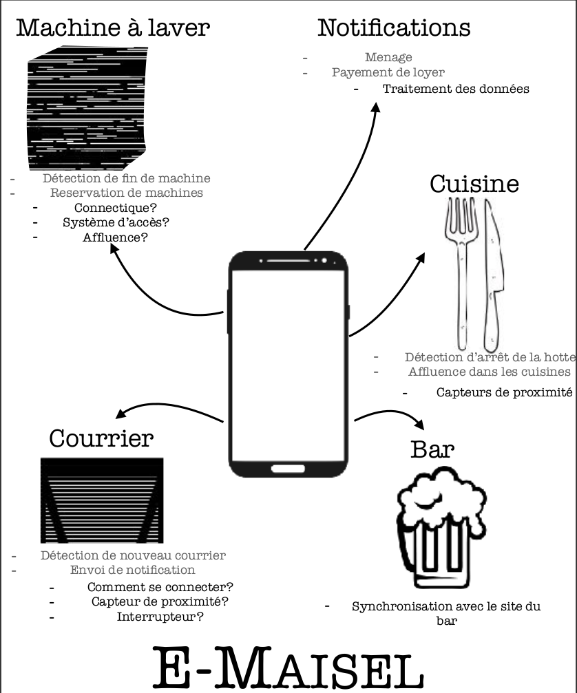
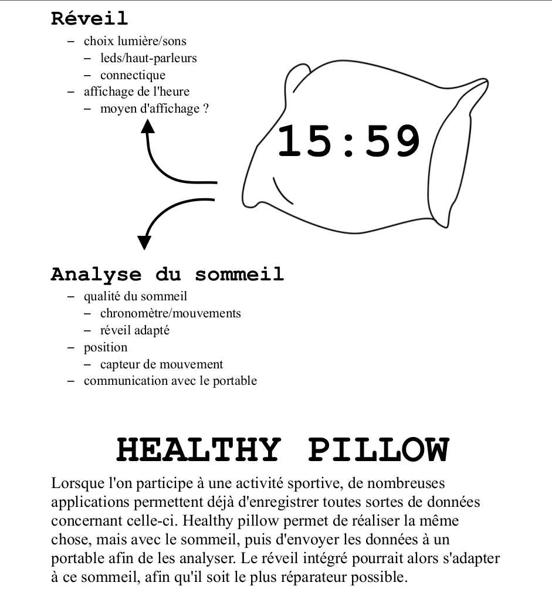
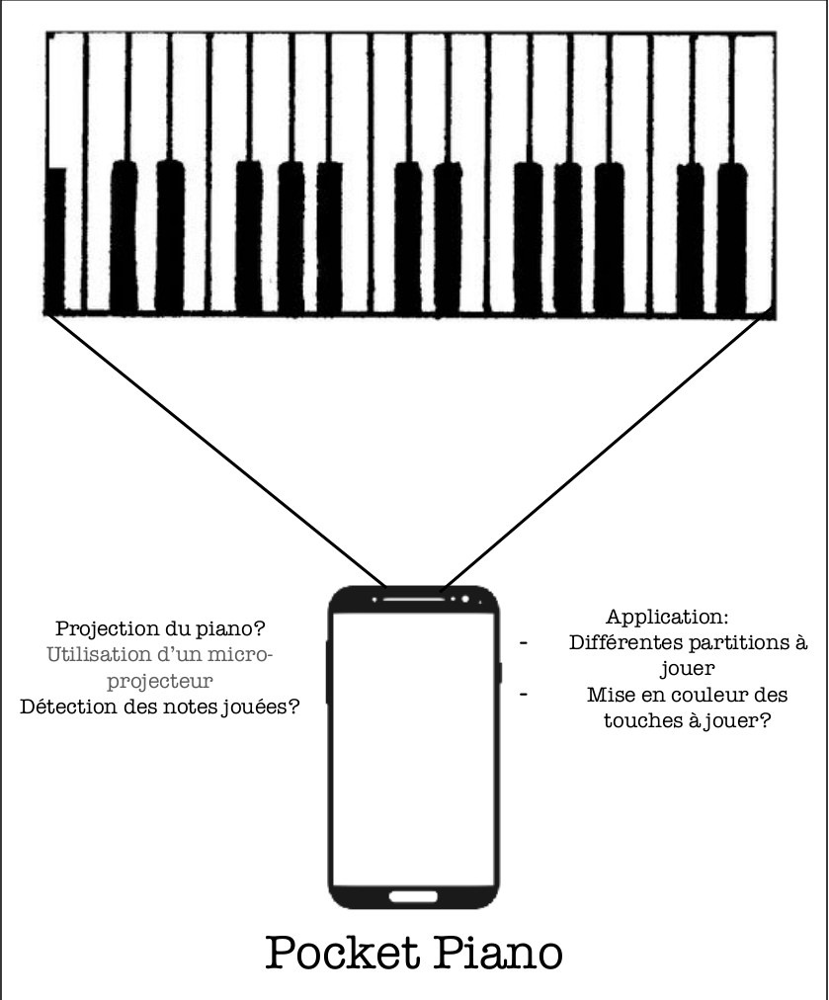

=== Comptes Rendus de réunions
////
Insérez ici vos comptes rendus de réunions : date, durée, participants,
sujets abordés.
////
==== Réunion du 02/10/2017_Idéation

Liste des idées :

    • Projeter sur le clavier de piano (à queue par exemple) pour éclaire quelle note à appuyer pour jouer

    • Détection des mouvements par l’activité de cerveau à partir du capteur EEG.
    
    • Photo traitée et imprimée : souvenir donc domicile dans un endroits où l’on peut prendre tous les détails

    • Réimprimer les clés en 3D à partir d’une photo.

    • Application pour calculer le nombre de gramme que chaque personne a dans le sang en fonction de la morphologie et du temps

    
Campus du futur/ golem numérique

    • Magasin, tester l’affluence d’un magasin dans les rayons. Pour optimiser la vente

    
Campus du futur

    • Puce GPS sur les clés pour les retrouver sur son téléphone. 

    • Sur le campus du futur, distributeur de pièce

    • Capteur d’affluence dans les bus pour saclay 
    
    • GPS dans le campus du futur pour se repérer dans le campus (sur tableaux numérique itinéraires personnalisés pour chaque personne) 
    
    • Localisation dans le campus : amené par un robot en cours

    • Application de rencontre pour les sports/ soirées

    • Stade connecté : piste d’athlétisme qui mesure les temps/ stade de foot qui détecte les fautes
    
    • Mettre une clé de voiture dans un casier et il s’ouvre que quand le taux est inférieur au taux autorisé

    • Se faire livrer son petit dej dans sa chambre par la demain dans la chambre 

    • Laverie : savoir quelles machines sont libres, réserver sa machine à partir de chez soi 
    • Notification quand c’est terminé

    • Oreiller connecté 

Golem du numérique 

    • Golem sur l’écran que l’on contrôle par la parole. 

    • Golem numérique que l’on commande par la voix création d’un jeu vidéo

    • Golem traducteur par la voix

    • Cabine d’essayage sur demande 

*Idées retenues : *
    • Piano de poche
    • Laverie
    • Cabine d’essayage 
    • Oreiller connecté 
    • Piste d’athlétisme

*Idées Présentés: *
 * E Maisel
 * Oreiller
 * Piano

==== Réunion du 16/10/2017 _Présentation experts:

* E-Maisel:

* Oreiller:

* Piano:

==== Réunion du /11/2017 _Retour experts:
	 	 	 	
PACT – Retour des experts

=== E-Maisel

_Modules :_ serveur + Android -> pas de difficulté +
Projet réalisable : concret, original, utile +
_Machine à laver :_ interrupteur à vibration ou accéléromètre (pas de problème de précision) +
Mais il faut faire des test (gens qui passent, objets posés +
_Courrier _: capteur optique de proximité : ok +
Idée : trop de bruit au foyer ? -> signaler (pas de spam) +
_Cuisine _: 2 capteurs optique pour détecter le passage -> OK +
Notes de Florian : +
zigbee meshbee OSource relier a une carte centrale serveur web portée reliée raspberry py +maitre réseau qui est en fait le serveur API Julien Romero ML Embarqué

=== Pocket Piano

Ambition :

 *Piano entier 
 
 * Plan B : 	1 octave 	
 
 * Plan C : 	Xylophone 	
 
 * Plan D : 	pad/batterie 	

Projecteur + téléphone (2 caméras-> attention à la synchronisation) +
Imprimante 3D ? +
Déjà eu des projets comme ça. +
Spécialiste : Isabelle Bloch +
Lecture de partition :
 * Une note : 	plusieurs notes 	

 * Manuscrit
Piano=risqué :
 * Pad/ 	batterie = mieux 	
Pas de problème audio : très facile

RETOUR FINAL : E-maisel : +
Un module traitement de signal. +
Problème : on traite des données que l’on ne connait pas. Comment débruiter le signal.

==== Réunion du 23/11/2017

** Répartition des tâches pour le PAN1:

Soline, Paul : Etat de l'art
Zoé : Proposition + diagramme/scénario repris
Guyu : diagramme Gantt
Florian :  Identité + reunions 
Alexandre : résumé 15 lignes

==== Réunion du 12/02/2018

Etat de l'avancement de chaque module.

* Base de données :

- 2 tables : statistiques et utilisateurs
- Utilisateur : stocke les identifiants et mots de passe de chacun
- Statistiques : permet de savoir en moyenne combien de personnes passent en
cuisine sur chaque tranche horaire (aussi en fonction des jours).

Remarque : Tout autre table est inutile, il peut y avoir une communication
directe hardware/android.

Objectifs PAN3 : expert à contacter pour les définir.

* Android :

- Rapport de conception réalisé, qui définit les bases de l'application mais
qui est inexacte poru la plupart des objets/méthodes. A modifier en fonction du
code écrit.
- Au niveau communication client/serveur :
    Login - identifiants et mots de passe à récupérer (géré par la BDD)
    Machines - états à connaître, réinitialisés lorsque l'activité est actualisée
    Cuisine - nombre de personnes et plaques, idem pour la réinitialisation

Objectif PAN3 : expert à contacter pour les définir, mais probablement une
application à peu près terminée, qui fonctionne + mails à intégrer.

* SES :

Module terminé.

* Intégration :

Objectifs PAN3 : prototype qui fait bien communiquer tous les modules entre eux.

* Hardware :

- Capteurs qui fonctionnent tous.

Objectifs PAN3 : écrire les codes pour l'intégration android, faire fonctionner
en wifi.

* Communication client/serveur :

- Explication du principe de fonctionnement à l'ensemble du groupe, accord sur
les différentes notations prises dans les différents modules, mise au point des
protocoles à utiliser.
- Utilisation d'identifiant par téléphone pour faciliter l'utilisation des
subscribers/publishers.
- Utilisation d'un serveur MGTT pour la mémoire vive et l'intéraction hardware/android.

Objectifs PAN3 : expert à contacter pour les définir.

==== Réunion du 05/03/2018

Etat de l'avancement de chaque module et du projet en général. Retour de notre encadrant.

==== Réunion du 12/03/2018

Mise en relation des différents modules et des langages et adaptations à faire pour qu'ils fonctionnent correctement ensemble.

==== Réunion du 18/03/2018

Intégration de toute la partie laverie de notre application.

Finalisation de codes Communication Client/Serveur, Android, Hardware et Base de Données.

==== Réunion du 26/03/2018

Réunion pour faire le point sur l'avancée de notre travail et pour travailler.

==== Réunion du 22/04/2018

- Bilan sur l'avancement de chaque module. Bilan sur l'intégration et prévision de créneaux pour travailler entre binômes inter-modules.

- Premier jet du scénario de la vidéo de présentation.

- Préparation du poster.

- Mise en place de l'organisation du prochain mois.

==== Réunion du 02/05/2018

Finalisation du poster. Retour de notre encadrant sur la mise en forme.
