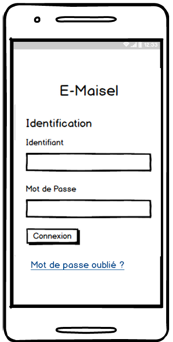
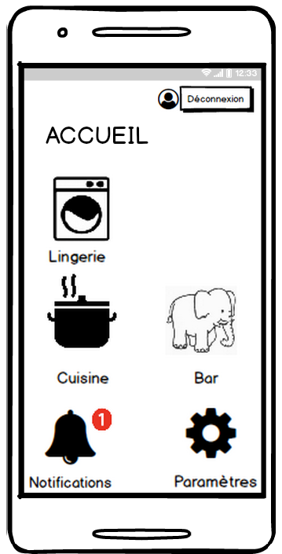
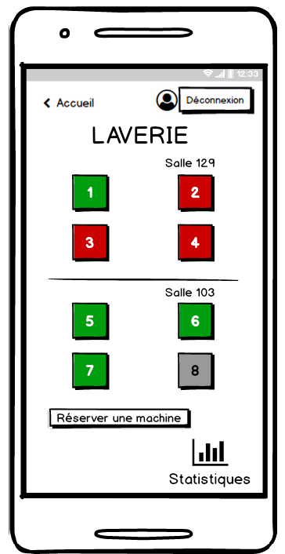
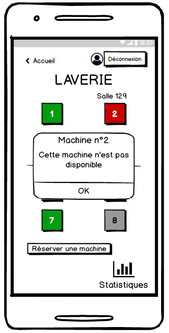
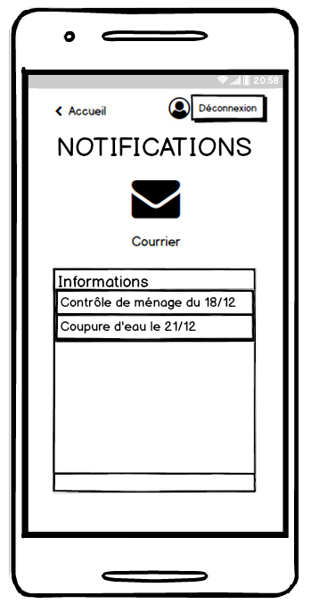
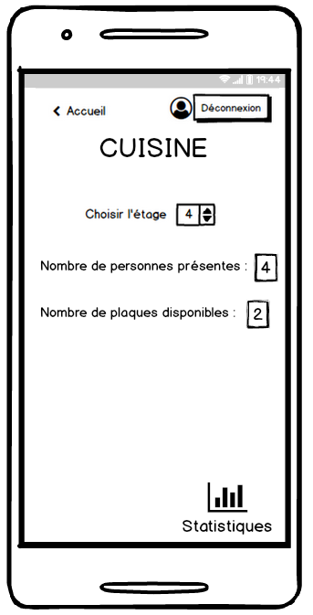

=== Interface utilisateur graphique

//Il peut y avoir une ou plusieurs interfaces utilisateur (UI en anglais), ou interface graphique, ou interface homme machine (IHM) : une interface sur ordinateur et/ou une interface sur mobile ou tablette (Android), selon le nombre d’appareils en jeu.

Notre projet se présente sous forme d'application Android, donc une unique interface
homme/machine sur mobile ou tablette. Le but de cette application est d'offrir
toutes les fonctionnalités décrites par ce projet.

//En lien avec un diagramme de séquence, une description simple de chaque écran/page est nécessaire. Il est recommandé de faire des dessins, même dessins au crayon photographiés ou scannés, car ce sont les meilleurs
//supports de discussion : on appelle souvent ces dessins un « storyboard ». Une description textuelle fait le lien entre tous les éléments de l’IHM (ou des IHMs).

= Storyboard :

* Identification :

* Accueil :

* Laverie :

* Notifications :

* Cuisine :

* Autres :

On trouve de plus d'autres activités telles qu'une activité Paramètres ; une
activité Statistiques affichant l'affluence dans les cuisines et les laveries
en fonction des jours et de l'heure ; une activité Informations qui permet d'afficher
les informations de l'application.