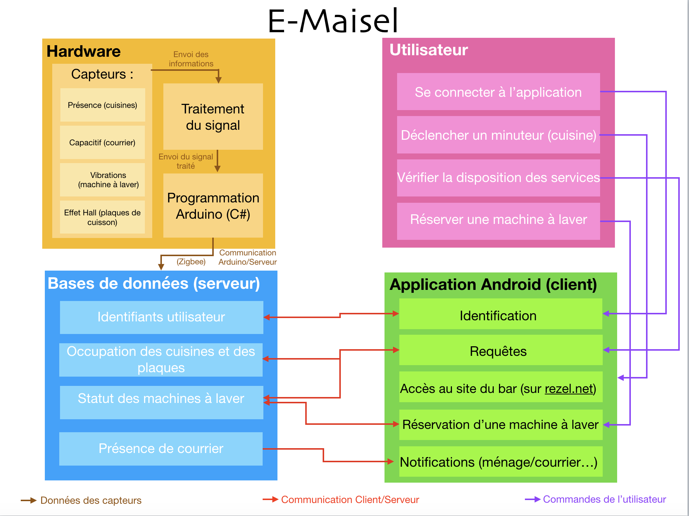

=== Schéma d’architecture

==== Description des blocs
////
Il faut ici une description textuelle de chaque bloc, sa fonction
détaillée. En général, un bloc correspond à un module, sauf exception.
Il peut être adapté de faire des blocs plus petits qu’un module.

Il est important ici de distinguer les bibliothèques identifiées et
disponibles de ce que vous allez produire (coder) vous même. Vous ne
devez pas réinventer la roue mais vous ne devez pas non plus avoir votre
projet tout fait en encapsulant un programme déjà existant.
////
===== Hardware

Ce module a une importance particulière car il est le fondement de notre projet:
nous avons de différents capteurs afin de récolter les données nécessaires à notre application.
Plus particulièrement, nous avons besoin de capter les présences dans la cuisine, si les boîtes aux lettres contiennent ou non du courrier, les vibrations des machines à laver ou encore si les plaques sont en route dans la cuisine.
A partir des informations collectées par ces capteurs que nous traitons ensuite, nous avons recours à un arduino.

===== Utilisateur

L'utilisateur de notre application peut, dans un premier temps, se connecter à l'application. Par ailleurs, l'application lui propose d'autres fonctionnalités: il peut réserver une machine à laver notamment, ou déclencher un minuteur.
De plus, il peut visonner l'état des différents services proposés, c'est-à-dire, par exemple, voir si toutes les machines sont occupées, ou regarder le nombre de personnes dans la cuisine d'un étage.

===== Application Android

Le travail dans ce module est tout d'abord de programmer l'application "e-Maisel". 
Pour cela, nous devons être capable d'avoir accès aux mails des utilisateurs dans le cadre des notifications (ménage, loyer).
Nous devons de plus pouvoir accéder aux données du site Babar, et pouvoir programmer les réservations de machine à laver.
En outre, chaque utilisateur devant se connecter, ceci doit aussi être implémenté.

===== Bases de données

Ce module représente la gestion de toutes les données obtenues grâce aux capteurs, et il y a communication Arduino/serveur grâce à zigbee. 
Les données doivent ensuite être interprétées et envoyées à l'application.
