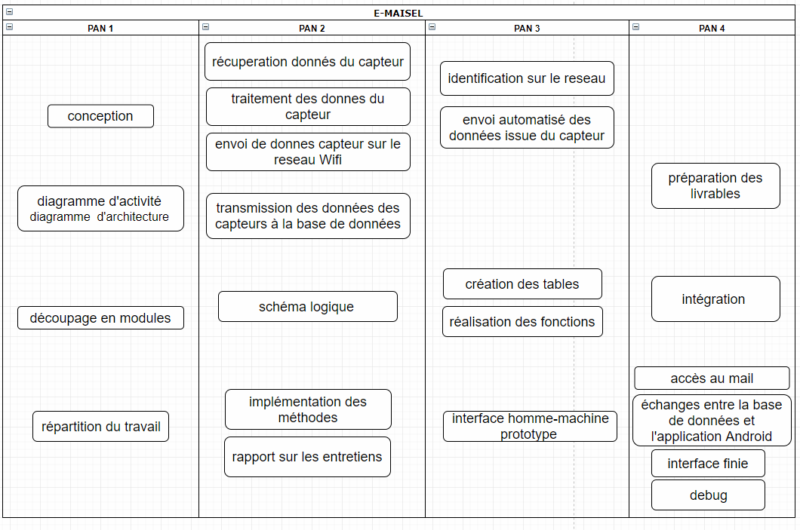

=== Diagramme de planification temporel des tâches
////
L’ensemble du déroulement de PACT est disponible sur le
https://pact.wp.mines-telecom.fr/dispositif/deroulement-2017-2018/[_site
pédagogique_].

Toutes les tâches et sous-tâches du projet doivent apparaître dans un
diagramme où figurent en abscisses les dates des 4 PANs et en ordonnées
les tâches et sous-tâches numérotées. Remplir en couleur les cases où la
tâche est active en prenant garde aux dépendances entre tâches. Indiquer
via des flèches le moment auquel la tâche entre dans la phase
« intégration » ou quand deux tâches indépendantes doivent se
synchroniser.

A chaque PAN, sera vérifié l’avancement des tâches selon le schéma
prévisionnel. Celui-ci peut être mis à jour, avec l’accord des experts
concernés, en cas d’imprévu.

_Note 1_ : http://fr.wikipedia.org/wiki/Diagramme_de_Gant[cf.] (pour un
exemple, mais il ne vous est pas demandé d’utiliser un logiciel pour
réaliser votre diagramme, un simple tableur suffit).

_Note 2_: Vous avez des références d’outils que vous pouvez utiliser
dans la liste des composants méthodologiques.

_Note 3_ : ne pas oublier d’inclure les tâches nécessaires à l’étude
bibliographique, à la préparation des livrables (rapports,
présentations, vidéo) et à l’intégration des modules dans le prototype.
////

