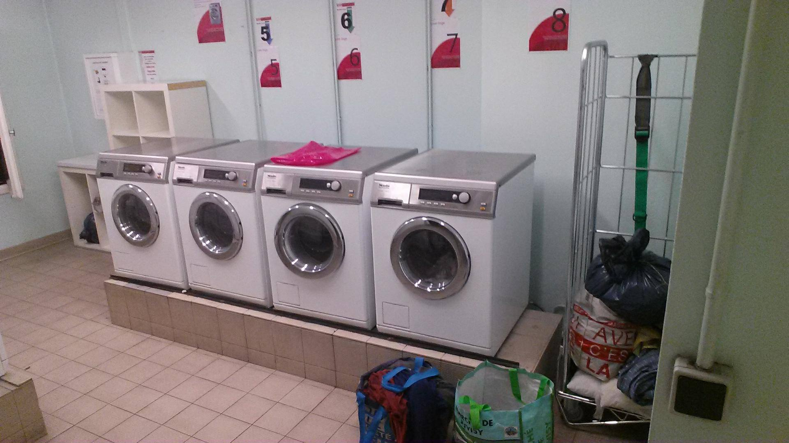
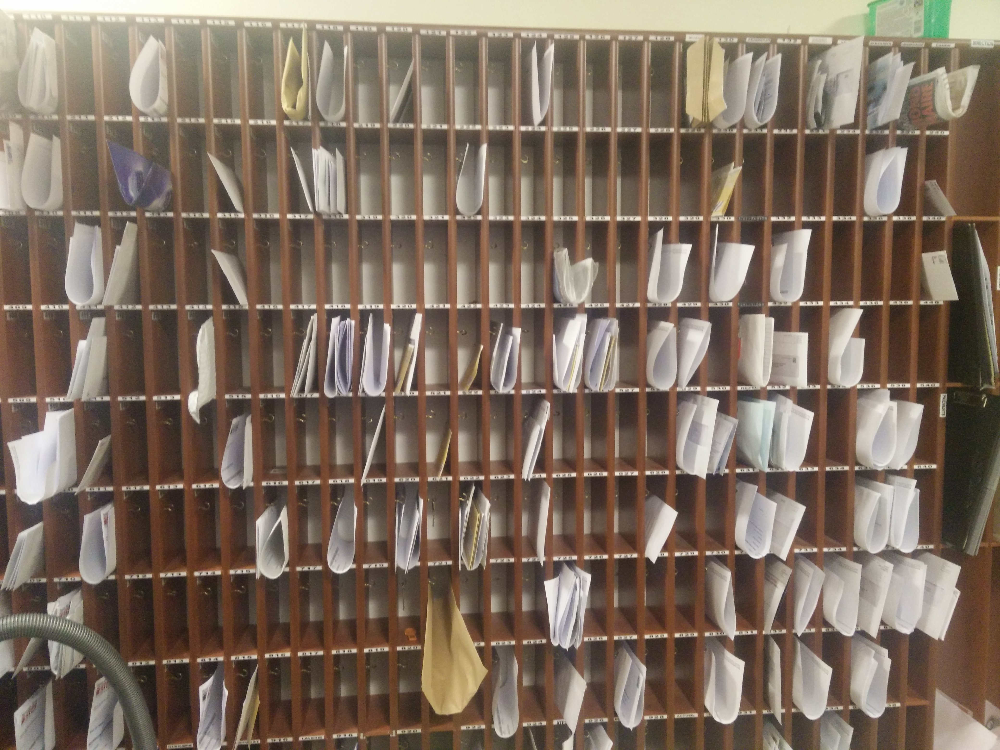

=== Description de la proposition

Deux thèmes nous ont été présentés au début de notre année scolaire, dans lesquels pouvait s'inscrire notre projet : Campus du Futur ou Golem Numérique. Nous nous sommes alors demandé ce qui pourrait être utile à de futurs étudiants, en nous concentrant sur les problèmes que nous avions rencontrés jusque lors. C'est alors qu'un des membres de notre groupe à suggérer de faciliter l'utilisation des machines à laver de la Maison des élèves (Maisel). En effet, il n'y a qu'un nombre limité de machines pour un nombre quant à lui important d'habitants, ce qui entraîne assez régulièrement des conflits. De plus, les habitants de la Maisel 2, qui se trouve à 5 minutes à pied, utilisent aussi ces lave-linges et peuvent être exaspérés lorsqu'il n'y a aucune machine libre à leur arrivée.

Quitte à faciliter l'utilisation de la laverie, nous pouvions aussi faciliter l'accès à d'autres informations ou services proposés par la Maisel : les boîtes aux lettres, les cuisines et la réception d'e-mails concernant le changement des draps ou le paiement du loyer. Pour le courrier, l'accès à celui-ci se fait à l'accueil, où il est nécessaire de demander à l'employé présent s'il y a des lettres dans le casier portant le numéro de notre chambre. Lors de file d'attente devant cet accueil, ou pour éviter de demander chaque jour s'il y a du courrier, certaines personnes ne récupèrent celui-ci que plusieurs jours après sa réception.

Les courriels envoyés par l'administration de la Maisel sont souvent envoyés sur une adresse mail différente de celle de l'école, puisque l'inscription s'est faite avant la rentrée. Il faut alors consulter plusieurs boîte mail pour obtenir toutes les informations.
En outre, l'absence de cuisine au 1er et au 9ème étage entraîne parfois des surpopulations des cuisines des étages avoisinants. Les occupants de ces étages ne savent alors pas s'il y a des plaques libres dans leur cuisine.

Notre application a pour but de remédier en partie à ces problèmes. Grâce à E-Maisel, l'utilisateur pourra consulter le nombre de machines disponibles instantanément, et éviter un aller-retour inutile s'il n'y en a aucune de libre. Il pourra de même réserver pendant 5 minutes une des machines disponibles le cas échéant, pour qu'elle ne soit pas de nouveau utilisée le temps qu'il y accède. Les fonctions en rapport avec les cuisines seront les mêmes, si ce n'est qu'il n'y aura pas de possibilité de réserver une plaque de cuisson. L'application permettra aussi d'envoyer une notification lors de la réception de courrier, afin d'optimiser l'attente à l’accueil, et d'afficher les courriels de la Maisel ainsi que les statistiques du bar. Finalement, elle permettra à l'aide des données récupérées d'établir des statistiques quant à l'affluence en cuisine ou dans les laveries, les habitants pouvant alors choisir le meilleur moment possible pour l'utilisation de ces services.
